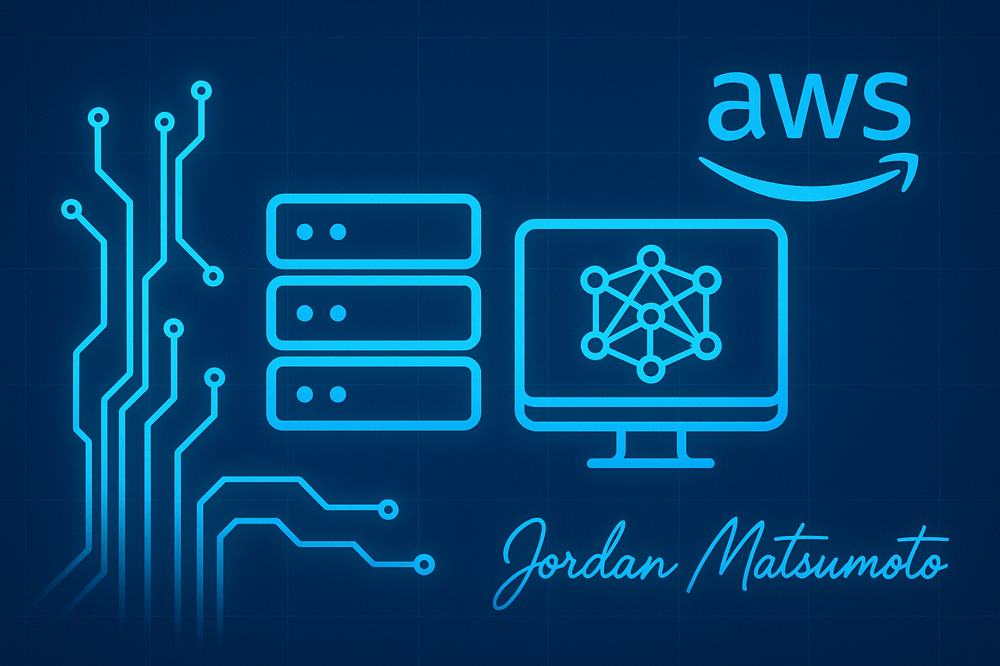

Hi, I’m Jordan, an AI/ML Engineer and AWS Cloud Engineer specializing in building production-grade AI systems, including LLM applications, multimodal assistants, RAG pipelines, and fine-tuned models deployed at scale. I focus on transforming complex requirements into fast, reliable, and user-ready AI solutions.

My background in AWS supporting high-severity, production-down enterprise environments has shaped the way I engineer systems, with an emphasis on scalability, observability, and operational excellence.

---

## Featured Repositories

### [Pricely](https://github.com/jordanmatsumoto/pricely) — Multi-Agent AI Price Estimator

Fine-tuned Llama model combined with GPT‑4o agent and RAG for collaborative price estimation.

* Fine-tuning tracked in [Weights & Biases](https://wandb.ai/jordanmatsumoto-independent/pricing-ai/reports/Training-Report--VmlldzoxNTAyNzQ5Ng)
* Deployed on [Hugging Face](https://huggingface.co/jordanmatsumoto/pricing-specialist) & Modal
* Real-time ranking, validation, multi-agent reasoning

### [Promptly](https://github.com/jordanmatsumoto/promptly) — AI Productivity & Task Manager

AI-enhanced tasks, projects, notes, and real-time suggestions.

### [SageGPT](https://github.com/jordanmatsumoto/sagegpt) — Multimodal Coding Tutor

Generates explanations, diagrams, code, and optional TTS responses.

### [Chronicle](https://github.com/jordanmatsumoto/chronicle) — AI Meeting Assistant

Transcription, structured meeting minutes, and PDF/Word export.

### [Wisdom](https://github.com/jordanmatsumoto/wisdom) — RAG Knowledge Assistant

Context-aware question answering, vector search, and live document exploration.

---

## Skills & Technologies

**Cloud:** AWS (EC2, Lambda, S3, VPC, IAM, CloudWatch, SQS, SNS, AppSync, Amazon MQ, IoT, Chime SDK, CloudFormation)

**Languages:** Python, JavaScript, HTML/CSS

**AI/ML & Frameworks:** PyTorch, scikit‑learn, Transformers, LangChain, Chroma, Gradio, NumPy, pandas

**LLMs & Tooling:** OpenAI API, Llama (Ollama), Claude, Gemini, DeepSeek, Weights & Biases, Modal, Docker, Git

---

## Additional Repositories

* [ML Portfolio](https://github.com/jordanmatsumoto/ml-portfolio) — classical ML algorithms, feature engineering, EDA, and evaluation notebooks.

* [Stellar Defense](https://github.com/jordanmatsumoto/stellar-defense) — 2D space-shooter game: showcases OOP structure, collision systems, animations, and a polished game loop.

---

## Connect With Me

**LinkedIn:** [View LinkedIn Profile](https://www.linkedin.com/in/jordanmatsumoto/)

---

*If you like my work, feel free to star a repo or reach out!*
